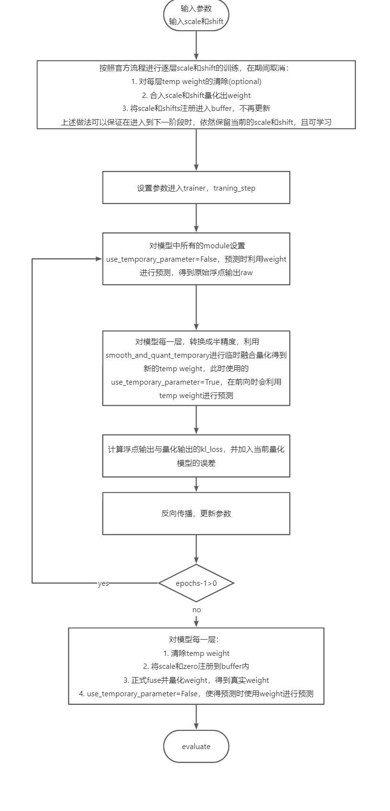

# Omniquant with global finetune
> chenzx

## 0. Env & data 

同官方readme

## 1. global finetune

提供两种方式：

（1）直接读取scale和shift进行全局finetune，不再进行逐block微调

（2）在逐block微调的基础上，保留scale和shift的可学习性，进行全局finetune

主要代码逻辑如下：


## 2. 执行方式
根据上述两种支持方式，以及原有omniquant，给出llama2-7b上的示例：
### 2.1 原有omniquant逐block训练
```
CUDA_VISIBLE_DEVICES=0 python main.py --model /data01/ssd/llama2-7b-hf/  --epochs 20 --output_dir
./log/llama--7b-w4a16-global_debug --eval_ppl --wbits 4 --abits 16 --lwc --let --act-scales ./act_scales/llama2-7b.pt --act-shifts ./act_shifts/llama2-7b.pt -
-net Llama-2-7b --train_mode layer_by_layer
```

### 2.2 全局训练
```
CUDA_VISIBLE_DEVICES=0 python main.py --model /data01/ssd/llama2-7b-hf/  --epochs 20 --output_dir
./log/llama--7b-w4a16-global_debug --eval_ppl --wbits 4 --abits 16 --lwc --let --act-scales ./act_scales/llama2-7b.pt --act-shifts ./act_shifts/llama2-7b.pt -
-net Llama-2-7b --train_mode global_ft
```

### 2.3 联合训练
```
CUDA_VISIBLE_DEVICES=0 python main.py --model /data01/ssd/llama2-7b-hf/  --epochs 20 --output_dir
./log/llama--7b-w4a16-global_debug --eval_ppl --wbits 4 --abits 16 --lwc --let --act-scales ./act_scales/llama2-7b.pt --act-shifts ./act_shifts/llama2-7b.pt -
-net Llama-2-7b --train_mode layer_global_ft
```

> Attention： 不同阶段loss不同，对应的参数不同，目前全局的参数仍在调试中，联合训练中的第二阶段参数写在main.py中，需要手动修改，后续参数稳定后，会加入到args中